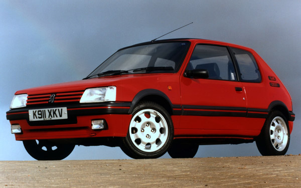
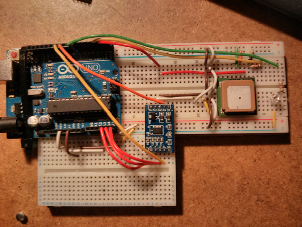

red5
----

Open source racecar telemetry platform - running on Raspberry PI and Arduino.

[Peugeot 205 GTI](http://en.wikipedia.org/wiki/Peugeot_205)

## Prototype V1

We had a race car driving fast around a track broadcasting it's GPS and accelermeter values in realtime (10Hz) to 2 phones & a browser in Edinburgh over Tinternet.

 * [Read the blog post](blog/madhack.md)
 * [The Readme](v1/README.md)

## licence

MIT