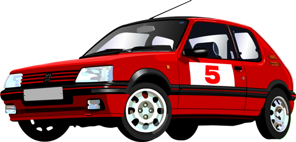

red5
----

Open source racecar telemetry & video platform - running on Raspberry PI and Arduino.



Our [Peugeot 205 GTI](http://en.wikipedia.org/wiki/Peugeot_205) hooked up with the telemetry kit

## Objective

To live stream telemetry data and video from race cars driving around tracks over 100Mph.

The telemetry & video can come from:

 * red5 blackbox
 * red5 app on phone

Both devices (blackbox and iphone/android phones) have the following features:

 * camera
 * GPS
 * accellerometer
 * compass
 * gyroscope

## Current Status

[Prototype number 1](https://github.com/binocarlos/red5/tree/bd34dfdbcd0db8917678257b94a0754f8c190df2) validated the concept

## Prototype V2

The next version will have a Raspberry PI camera module attached.

```
PIT BOX   <------->

                      SERVERS  <------> Browsers

LIVE CAR  <------->
```

## licence

MIT