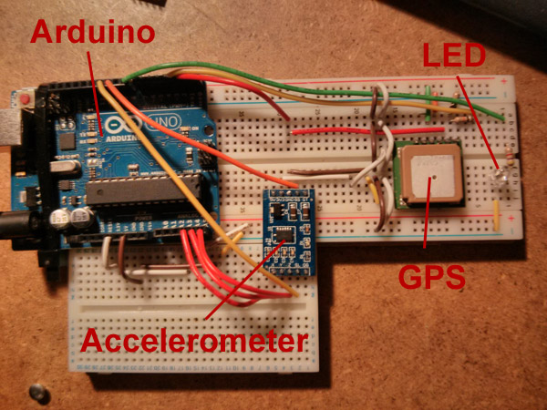
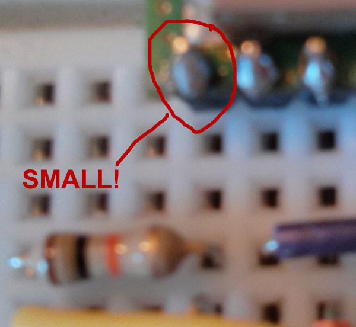

MadHacker
---------

I just did one of the best and most satisfying hack sessions of my life.

Here is a run down - it's heavy, keep up : )

##The project
the have our race car going around the track and for it to broadcast live telemetry data to the Internet and for us to watch the data, live, from our phones on the pit wall.

##The state of play
I spent an arduious few months learning basic electronics (thanks to the [free online MIT course](http://ocw.mit.edu/courses/electrical-engineering-and-computer-science/6-002-circuits-and-electronics-spring-2007/index.htm)) and solidering (thanks to a lot of patience and swearing).

We had an [Arduino](http://www.arduino.cc/) with a GPS chip and an accelerometer with an LED plugged in that flashes when a proper [NMEA](http://en.wikipedia.org/wiki/NMEA_0183) GPS sentence is recieved (i.e. the chip has got a lock onto the statellites).

##Getting the GPS soldered and speaking to satellites
The night I nailed the soldering was cool - there was a satellite twinkling in the midnight sky - I had spent the past 2 hours labouriously slaving over a magnifying glass to get the darn solder onto the tiny header pins.

It was ready - I turned it on was took the 5 metre USB cable so I could hold the whole unit out of the window.

I was printing the output of the arduino Serial.println command - this was going down the USB serial cable @ 56700 baud and printing out on the PC just fine.

So when I was waving this thing out of the window yelling at the statellite to see it and make the little LED flash and I let out a little yelp when the little bugger started to blink at me.  I literally looked up at the statellite and IT was blinking at me too.

It was like the mother and daughter of Global Positioning were beaming at each other throught the night sky!

Anyways - enough nostalgia - onwards!

##The hack night
We had a track day at Castle Combe on the 10th May 2013 - this was tomorrow and I had vaugly said I would get some king of GPS logging onto the car for that day.

Having (as always) been bogged down with lots of work however - I had left it until the day before and not really got any further than the night with the GPS chip.

So - we got the car out of the garage and did all the gubbins in the afternoon - this took till about 4 o'clock.

I got home - sat down and thought:

	right - how can I save the GPS and perhaps broadcast it live on the Internet?

###Raspberry PI
The first step was to get some resemblance of a computer which was talking to the Arduino like the home PC was.

Luckily I had a [Raspberry PI](http://www.raspberrypi.org/) to hand.

This was going to read the Arduino Serial connection and save the data to SD card at 10 times per second.

I used [node-serialport](https://github.com/voodootikigod/node-serialport) as the library to speak directly to the arduino and used a custom protocol for speaking NMEA sentences and accelerometer X,Y,Z sentences.

###node.js
I wrote a node.js script using node-serialport that sat in a loop and waited for the arduino to speak some data.

It then appended this data onto a file as a form of local backup (we can now load the GPS/accelerometer data from the SD card later).

##website
I spun up a Rackpspace instance and pointed thetracktube.com at it.

I wrote a very basic express app that hosted a bootstrap page with a socket.io connected back to the express app.

The app had a post /ping handler that was meant for the Raspberry PI to speak it's data sentences to.

The app would then broadcast any of these pinged data sentences out to every browser connected via socket.io.

Bosh - we have a live broadcast network that spans the Internet for the telemetry coming of our race car.

Problem - how do we connect the Raspberry PI to the Internet and power the whole thing from a race car?

##The power, Internet and it being inside of a race car problem
The Internet was the next step.

I was using a dongle from three.co.uk that did HSPA 4g speeds (where available).

You have to power this thing from an external USB hub (the PI cannot power it) and so we have four main components now:

 * Arduino
 * PI
 * USB Hub
 * 3g Dongle

I used a program called Sakis to configure the dongle - which showed up as a USB device inside /dev

Once we had the settings for Sakis - I could tell the PI to automatically connect to the Internet by running the same settings via Sakis upon start up (using the /etc/rc.local script).

This meant that as the unit lost and regained power throughout the day - it would automatically re-connect to the Internet.

I did not have the time to get SSH access going onto the PI also (I could have done with a WIFI dongle but I was running out of time).

So - everything just needed to work - first time with no plan B - I realise why the software for the Mars rover was fixed for like 7 years before launch now : )

Anyways - I was getting the whole setup - with no power, power it on - wait 1-2 minutes and the dongle would be flashing in the nice 'I'm connected' color - cool!

Next step - add the node.js script we wrote to /etc/rc.local and now the whole PI/Arduino is an automatically booting Internet speaking telemetry unit.

##Power
How to power the thing from the car battery was the next step.

Me and Kris had gone to a camping shop that day and found a cool thing that took the 12V supply from the car battery and turned it into a 220-240V supply via a standard wall socket.

This meant that without mucking about I could power the USB hub via the transformer using just a standard plug - the easiest most hassle free way to do it!!!

##Inside a Race Car
So - now we are at the track the next day and we realised we could not stick my crappy card-board box in - that would be seriously unsafe at the speeds we go round corners - also the marshalls would have a word before we even got out on the track.

So - this is where Kris's skills with making stuff very neat and tidy came into their own.

Within 5 minutes we had (and totally improvised from stuff hanging around in the van) a plastic container with holes drilled for the GPS and 3G dongle with foam inside and literally strapped to the body-work of the car - it looked solid and was going no-where.

##The test
We turned the unit on - the lights came on (yay).

Within about 30 seconds the LED for GPS fix started to flash (yay).

Within about 1 minutes the 3G dongle came online (yay).

I jumped into the car had a drive.

I came back.

Kev said they were watching my speed, Latitude, Longitude and acceleration in 3 axis update in realtime (as in 10 times per second) on his phone.

Gavin (my friend in Edinburgh) rang up during the day - I said 'hey - goto this page - can you see numbers updating?'.

He could see the numbers.

I was buzzing - with less than £100 we were broadcasting live telemetry to Edinburgh over 400 miles away.

I realised that even if someone was in Sydney they could see it (12 thousand miles away).

It worked !&!&!^!&££$&£*£(&*" : )